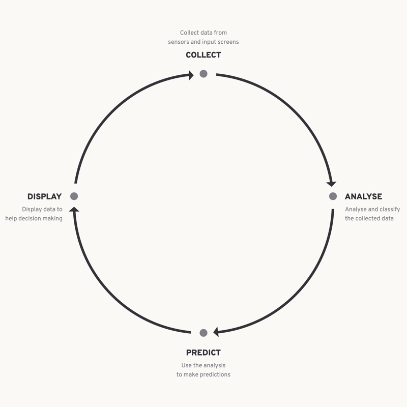

According to legend, the first maxim of the Oracle of Delphi - said to spring from Apollo himself - is to know yourself. Or in Greek: _nosce te ipsum, temet nosce_. Repeated twice for emphasis and for nuance. Know yourself, to your own self be known. To know and have knowledge of yourself and then to process that knowledge. To know and to accept.

The purpose of what has been a decades-long interest for me is exactly that, but a little more. What value do the days [23 September 2004](https://en.wikipedia.org/wiki/Portal:Current_events/September_2004#2004_September_23), or [8 July 1995](https://en.wikipedia.org/wiki/July_1995), or [17 February 2017](https://en.wikipedia.org/wiki/Portal:Current_events/February_2017#2017_February_17) have if they are remembered and known nowhere. Who were you on these days? We edit our lifes like film editors, cutting out the boring bits - but are these not the foundation of who we are. The accumulation of a person are the days without monumental events - where a series of small and large decisions define you, who you were, and who you will be. And in that way this project is also a <abbr>data</abbr> diary of a person. In an age where social media networks, search engines, and a hungry horde of algorithms know us better than we know ourselves - this project is my redoubt. I should be the expert of myself, and I should endeavour to be better for that challenge.

This documentation set covers the mechanism of collecting, analysing, and displaying information about myself to myself. As such, the primary reader is me - but if you find something of use, please feel free to use it. There will be typos, broken processes, and periods of inactivity - because life doesn't stop for measurements.

!!! info

    I will not be providing or responding to any support requests or questions generally.
    This project is mostly a personal enterprise at the moment.

## Principles

**Own all the data exclusively** 
Avoid storing any data on external services, even temporarily. This especially applies to health data.

**Delete nothing** 
Preserve all collected data, as it may have an unimagined use in the future.

**Automate as much as possible** 
Automate as much of the collection of data as possible to avoid influencing the results. The process should not impinge on the output.

## Data cycle

## Data collected

This list may grow and contract over time, as new data sources are added and others are hidden - but data is never deleted.

💶 **Financial:** 
Daily transactions (amount, time, date, category, subcategory, accounts, currency, location, brand, item), Investments (amount, grwoth/loss), Assets (details, cost, longevity, logistics)

🩺 **Health:** 
Exercise (reps, sets, exercises, bpm, location, weather), Metrics (heart rate, resting heart rate, average heart rate, weight, height, haemotocrit, haemoglobin, eosinophils, basophils, lymphocytes, monocytes, neutrophils, platelet count, red cell count, white cell count, mean cell haemoglobin, mean cell volume, mean cell volume, mean corpuscular haemoglobin, red blood width, esr, systolic, diastolic, waist circumference, body fat, chest circumference, thigh circumference, body fat mass, skeletal muscle mass, visceral fat, body water, total cholesterol, hdl cholesterol, ldl cholesterol, triglyceride, pGlucose fasting, anion gap, bicarbonate, chloride, potassium, sodium, urea, creatinine, b12, ferritin, tsh, freet4, thyroid peroxidase, eye axis, eye cylinder, eye sphere, vo2max, avgspo2, sperm motility, sperm count), Sleep (sleep phases, duration, location, weather, ambient light, sleep time, awake time)

🧠 **Mental:** 
Media (books, movies, tv, theatre), Productivity (pomodoro sessions), Emotional

## Roadmap

Work on this project is planned and managed on this [task board](https://github.com/users/gugulet-hu/projects/1/views/5).
