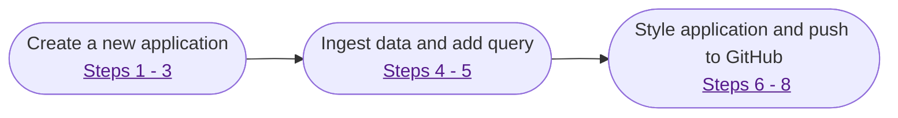

<!---
LOCAL STYLE GUIDE (remember to include in the Global Style Guide)

SPREAD Studio: Use the brand naming consistently. Spread iin all uppercase when referring to the studio application.
Spread: Always lowercase in normal copy.
GitHub: Style the name in the same way that Github does in their content.
Image Alt Text: Make sure to use descriptive text for all images. These are useful for SEO and site search. i.e 
Image Title Text; For accessibility reasona, image titles should be clear and understandable. See https://www.w3.org/WAI/tutorials/images/
Code indentattion: Exagerrate the indentation for easy reading and legibility. At least 8 spaces (or two tabs).
Bold text: Use bold for UI elements that are visible on screen.
Code tags: Use code tags for field values and code.
Numbered lists: Use numbered lists for things that need to be done in a specific order (and unordered lists for other lists).
Admonitions: No more than three admonitions on the page, to avoid making it look cluttered.
--->

Using the SPREAD Studio application on your local environment allows you to test, debug, and work on your application before deploying it for general use. We generally recommend that you maintain version control of your application using git. For more on version control, see the [Version Control at Spread](#) page.

## Setting up your local environment

<!---
Notes:
This content should start here. There is an assumption that the user has already set up their local environment.
This section is critical before we jump into creating an application.

Questions for SME:
- What are knowledge requirements for using thsi tool?
- What is the software needed to run the tool? (e.g. npm packages, CLI apps, OS, browser requirements)
- What is needed from the Spread infrastucture to make this work locally? (such as API keys or any other authentication methods)
--->

To create and manage applications locally you need to have the following tools and knowledge:

* An understanding of how to make queries to your database.
* A code or text editor to edit your application. We recommend using [Visual Studio Code](https://code.visualstudio.com), with the [XYZ plugin](#) installed for easy code completion.
* A Spread API key to fetch remote data. Create a separate API key with limited access rights for your local environment to limit the possibility of a security breach. For more on API keys, see [Creating and Managing API Keys](#).

## Restrictions and security

<!---
Notes:
Questions for SME:
- What are restrictions with running the applicastion locally?
- What are the limitations of the application genreally? Number of queries, apps, etc
- What are the security measures that need to be followed?
--->

Running the local application has limitations that may affect your workflow:

* Eros in cursus turpis massa. Convallis aenean et tortor at risus viverra adipiscing at in.
* Aliquam eleifend mi in nulla posuere sollicitudin aliquam ultrices sagittis.
* Urna id volutpat lacus laoreet non curabitur. Urna neque viverra justo nec ultrices.
* Eu mi bibendum neque egestas congue quisque egestas diam in. Arcu cursus euismod quis viverra nibh cras pulvinar mattis nunc.
* Commodo elit at imperdiet dui. Enim nec dui nunc mattis enim ut.

!!! warning "Warning"

    Data is not encrypted at rest. Please ensure that your local disk is encrypted and that your workspace is secure.

## Quickstart

<!---
Notes:
A quickstart section is like 'Hello World'. It gives the reader confidence that they can use the tool.
The example in the video takes detours and is not clear, whereas a Hello World needs to be simple and withiout the frills.
--->

This quickstart guide will introduce you to some of the main features of SPREAD Studio - such as making data queries, styling your application, and deploying it to production. Before starting, make sure that your local environment is [set up correctly](#setting-up-your-local-environment). The process is laid out in the diagram, with more detail in the list items.

<!---
Notes:
Documentation rot happens quickly with video and images. As much as possible use easily modifiable tools.
Below we have a diagram created using meramid.js as an example of easy-to-maintain visuals. No need for a designer to create this.
--->



#### 1. Run your local setup
Start the process by running your local setup with the command `kubectl get pod` in your terminal or console inside the **platform** folder of your working directory. If your environment has been [set up correctly](#setting-up-your-local-environment), it should show something similar to following output.

{width=320}

You can then open [studio.local.spread.ai](http://studio.local.spread.ai/applications) in your browser to access SPREAD Studio. The landing page for SPREAD Studio will show your workspace, with your current applications. This workspace is automatically created when you deploy applications.

#### 2. Create a new workspace
To create a new application select **+ New workspace** and set the details of the workspace by accessing the dot menu on the right-hand side. You can change the workspace name, edit **Settings**, add **Members** to the workspace, and do other workspace management tasks through this menu.

{width=500}

Once the workspace has been configured to your needs select the **+ New** button to start creating your application.

#### 3. Configure your new application
The application configuration screen will pop up. On the top-left, where the text reads **Untitled Application 1**, you can select the title to access the settings menu. on the left-hand side you will find the elements that you can use to create your application, such as **Widgets**, **Queries/JS**, and **Datasources**. The central area of the screen is where you can drag widgets and move elements to create the UI of your application. The right-hand side of the screen will contain the properties of the selected element. On the top-right you can find options to **Deploy** the application.

{width=500}

#### 4. Ingest data to populate your application
For this guide, we will ingest data by selecting the **Explorer** tab on the right-hand side and then selecting **+ New datasource** in the **Datasources** section. This will open options to select the type of data source you would like to ingest data from. Select **Authenticated GraphQL API**. In the following screen enter "http://local.spread/ein" (without quotes) in to the **URL** field and select the **Save** button in the bottom-right corner. This is a data source URL we use strictly for demonstrations.

#### 5. Make a data query to return a slice of the dataset
Select the **Explorer** tab on the right-hand side and then select **+ New query/JS**. In the **query** box you can add a query to return only the data we need. For our purposes we will be using the following data query:

```
query {
        datasets {
                edges {
                        node {
                                id
                                name
                                description
                        }
                }
        }
}
```

Once you have entered the query, you can select the **Run** button to run the query. The results of the query will display in the **Response** tab at the bottom of the screen.

{width=500}

!!! note "Please Note"
        You can create your own query by going to [local.spread.ai/ein](http://local.spread.ai/ein) and playing with the interactive query creator.

#### 6. Display the data
Widgets to display the data are under the **Widgets** tab. For this demo we will use the **Table** widget. Drag and drop the widget onto the central area of the screen. You will see that the Properties window on the right-hand side now has options for configuring your table. Under the **Data** section and in the **Table data** field enter query object created in Step 4. In our example the value is `{{get_datasets.data.data.datasets.edges.map(e => e.node)}}`.

{width=500}

You can also change the column order, make the columns editable, hide columns, and other options in the Properties window.

#### 7. Style your application

<!---
Notes:
This section was an unnecessary and complicated detour in the video. Styling is the frills and not really what you need to learn in a Hello World exercise.
--->

To set fonts, colours, borders, shadows, theme and other style settings click an open space in the central area. This brings up the options for styling the whole application in the Properties window on the right-hand side under **App settings** - and not just the Properties for a particular widget. You can also add widgets - such as buttons and headers - to make your user interface easy to use.

To preview your application select **Deploy** in the top-right corner.

#### 8. Add your application to the launcher page
The default landing page for SPREAD Studio in a local environment is [local.spread.ai](http://local.spread.ai). To add your newly created application to this launcher page we need to connect our local copy of the application to a GitHub repository. Select the small arrow next to the **Deploy** button in the top-right corner.

{width=500}

For more information on creating GitHub repositories and keys, see [Create a Repo](https://docs.github.com/en/get-started/quickstart/create-a-repo). Any further changes to your application can be pushed to the connected repository when you select the **Deploy** button or when you push a commit from the working directory to GitHub.


<!---
Notes:
All resources (such as the build.yml file) need to be provided directly, and not indirectly through complicated instructions
--->

Download the [build.yml]() Github Action and add it to your applications repository. This action will run when you deploy any changes to Github. For more information on creating and running Actions, see [Creating Actions](https://docs.github.com/en/actions/creating-actions). One of the actions of build.yml is to generate a JSON file that is pushed to Amazon AWS.

...
<!---
Notes:
I stopped at this point, because the manual actions taht followed need to be automated somehow. The process seemed unstructured from here. I would contact
the SME and ask them how this part of the process can be done better, without manually editing configuration files. Perhaps a CLi command that fetches the relevant text and places it in the right areas, but not what we currently have. A documentation writer is by necessity also in quality assurance and we can add value by noting processes that could be better.
--->

## Troubleshooting

<!---
Notes:
Collect the three most common errors or blocks that users run into when going through this process and offer solutions.
Ask the SME for solutions to problems they commonly see or trawl support queries for content.
--->
**Common problem scenario 1**<br>
Aliquam non erat leo. Pellentesque eu consectetur ex. Aenean risus orci, lobortis ac tempor at, venenatis at mi. Nulla sed venenatis velit, posuere lacinia neque. Morbi tortor orci, blandit et mollis vitae, finibus et nisl. Etiam sed justo sem. Proin eget pretium risus. Fusce tempor nisl quam, id dapibus urna viverra et. Nam efficitur nisi eu molestie varius. Morbi ac scelerisque magna. Donec efficitur quam eleifend faucibus bibendum. Fusce quis dolor nulla. Maecenas nec cursus velit. Nunc vulputate leo a mi ullamcorper bibendum.

**Common problem scenario 2**<br>
In hac habitasse platea dictumst. Aenean tempus felis vel metus sodales, nec tristique sapien efficitur. Aenean pharetra ante quis posuere interdum. Aliquam erat volutpat. Integer vulputate, velit commodo mollis pellentesque, augue risus vestibulum metus, at faucibus ipsum felis quis magna. Nam in congue massa. Pellentesque a vehicula arcu. Nulla auctor, lectus sed consequat convallis, ligula dui faucibus tellus, vel vulputate massa ligula nec risus.

**Common problem scenario 3**<br>
Curabitur eget porta risus. Fusce egestas tortor ut aliquet facilisis. Suspendisse quis sollicitudin eros, vel malesuada erat. Donec ac purus ullamcorper, lobortis nisi ut, bibendum elit. Fusce gravida sapien eu metus vulputate pulvinar. Curabitur nisi leo, mollis eu fringilla at, interdum accumsan quam. Praesent a fermentum massa. In finibus mollis sapien, a rhoncus turpis porttitor a. Praesent feugiat felis lacinia lacus accumsan, nec suscipit urna pellentesque. Proin metus nulla, mattis ac arcu vitae.

---

<!---
Notes:
This is the most important part of the document:
- Accountability: Who owns the document and is reposible for its upkeep?
- Maintenance: When was it last reviewed?
- Ownership: Who owns approval rights for changes to the documents? (i.e. who needs to understand this document?)
- Fallback: Who is the fallback option if the accountable writer needs help improving the document? (usually Documentation)
--->

<p style="font-size:0.7em">
Last reviewed by Gauthier Ralph, Value Engineer (2020.01.10).

This page is owned by Phileas Fogg, Junior Platform Engineer. If you don't understand the contents of this page or if the content is outdated, please help us make it better by emailing <a href="mailto: phileasf@spread.ai">phineasf@spread.ai</a> or post a message to the <a href="#">#ask-platform-team</a> channel on Slack. Alternatively, you can create a ticket on the <a href="">documentation board</a> and assign it to Jean Passepartout.</p>
